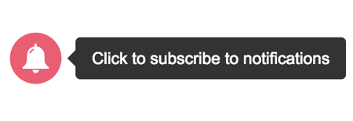

WonderPush Web SDK plugin to present the user an opt-in bell before prompting her for push permission.

Here is a screenshot of the default bell shown to the user if no option is given:

<center>

</center>

It appears on the bottom-left edge of the page and does not scroll with the page.

# How to use this plugin

## From the WonderPush dashboard

Log in to your [WonderPush dashboard](https://dashboard.wonderpush.com/) and head over to the _Settings / Configuration_ page in the left menu.
Select the _Website_ tab and use this plugin.

## From the initialization options of the SDK

Change your call to `WonderPush.init()` to include the following, merging existing keys as necessary:

```javascript
WonderPush.init({
  plugins: {
    "optin-bell": {
      // Add any option to customize the plugin as desired
    },
  },
});
```

You can find the reference of the options in the {@link OptinBell.Options} section of the reference.

# Reference

The available options are described in the {@link OptinBell.Options} section of the reference.

The available API is described on the {@link OptinBell} class.
